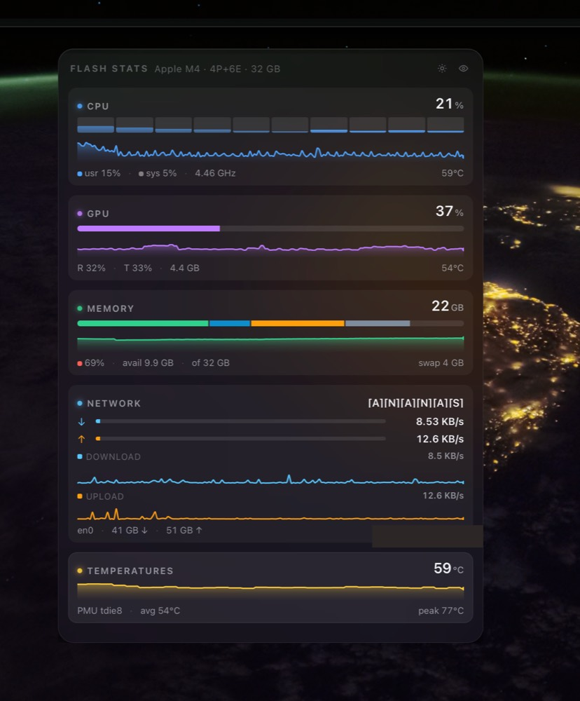
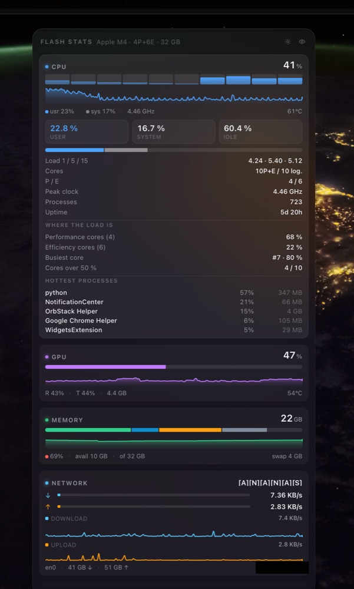
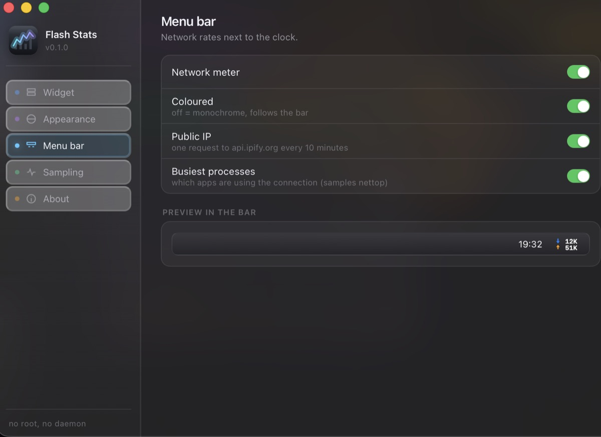

<p align="center">
  
</p>

<h1 align="center">Flash Stats</h1>

<p align="center">
  <b>A system monitor that lives on your macOS desktop like a widget.</b><br>
  CPU, memory, GPU, network, temperatures and battery.
</p>

<p align="center">
  <b>2.2&nbsp;MB</b> to download &nbsp;·&nbsp;
  no sudo, no daemon, no login item &nbsp;·&nbsp;
  one outbound request, with a switch to stop it
</p>

<p align="center">
  <a href="#install"><b>Install</b></a>
  &nbsp;·&nbsp;
  <a href="https://gitlab.com/palo.kunovsky/flash-stats/-/releases/permalink/latest/downloads/flash-stats-aarch64.dmg">Download the&nbsp;.dmg</a>
  &nbsp;·&nbsp;
  <a href="#where-the-numbers-come-from-no-root">How it reads the hardware</a>
  &nbsp;·&nbsp;
  <a href="CHANGELOG.md">Changelog</a>
</p>

<p align="center">
  
</p>

<p align="center">
  <i>It sits at the level of the desktop icons — above the wallpaper, below your
  windows, beside the system's own widgets. "Show desktop" leaves it where it
  is, and Mission Control moves it along with the desktop rather than stranding
  it.</i>
</p>

<p align="center">
  
</p>

<p align="center">
  <i>Download and upload stacked next to the clock, half the width of a
  side-by-side readout. Clicking it opens a network panel; the widget itself is
  toggled from the right-click menu, never by this.</i>
</p>

<p align="center">
  
</p>

<p align="center">
  <i>Every card opens for detail. CPU splits the load into user and system, says
  which cluster is carrying it, and names the processes responsible. Memory and
  network do the same for what they measure.</i>
</p>

<p align="center">
  
</p>

<p align="center">
  <i>Settings for what is worth choosing: which cards, where the widget sits,
  how often the sensors are read, °C or °F, and whether the one outbound request
  this app makes happens at all.</i>
</p>

Built with Tauri 2 (Rust) and React 19. No sudo, no root helper, no launch
daemon.

<a id="install"></a>

## Install

**Requires an Apple Silicon Mac on macOS 12 or later.** There is no Intel
build; see the roadmap.

### With Homebrew (recommended)

```sh
brew tap palo.kunovsky/flash-stats https://gitlab.com/palo.kunovsky/homebrew-flash-stats.git
brew trust palo.kunovsky/flash-stats
brew install --cask --no-quarantine flash-stats
```

Three commands, and it is the route that leaves nothing for you to fix
afterwards — see below for why `--no-quarantine` is there. Updates are
`brew upgrade --cask flash-stats`.

The middle one is not optional and not mine: Homebrew refuses to load a cask
from a tap outside its own repositories until you say you trust it, with
`Refusing to load cask … from untrusted tap`. It is asking whether you trust
me, which is a fair question to be asked about a stranger's install script.
`brew trust --cask palo.kunovsky/flash-stats/flash-stats` trusts only this one
cask instead of the whole tap.

### Or the disk image

[**Download Flash Stats**](https://gitlab.com/palo.kunovsky/flash-stats/-/releases/permalink/latest/downloads/flash-stats-aarch64.dmg)
— 2.2 MB — drag it to Applications, then run one command:

```sh
xattr -d com.apple.quarantine "/Applications/Flash Stats.app"
```

Older versions are on the
[releases page](https://gitlab.com/palo.kunovsky/flash-stats/-/releases).

### Why that command is necessary

The app is signed, but with an ad-hoc signature rather than an Apple Developer
ID, and it is not notarized — that certificate costs $99 a year and this is a
free tool. Apple's own `syspolicy_check` is blunt about the consequence:

```
Adhoc Signed App        Severity: Warning
Notary Ticket Missing   Severity: Fatal
```

So macOS will not open the app while the quarantine flag a browser attaches to
downloads is still on it. Clearing that flag is the whole of the workaround,
and it is exactly what `--no-quarantine` does for the Homebrew route.

**System Settings → Privacy & Security → Open Anyway** sometimes offers a way
through after a blocked launch, and it is worth a look — but do not count on
it. macOS 15 removed the older right-click → Open bypass, and the button is not
reliably offered to an app carrying no Developer ID at all.

Either way it is a one-time decision. macOS remembers it, and Homebrew upgrades
never ask again.

If handing someone a terminal command is not something you want to do, the
honest fix is the $99 Developer ID and notarization — nothing short of it makes
macOS open this app on a double-click.

Flash Stats has no Dock icon — it is a menu bar app. Look for the network
meter next to the clock.

### Wi-Fi network name

macOS treats the name of the network you are joined to as location data, so the
first launch asks for Location Services. Nothing else uses it, no position is
ever read, and declining only means the network card shows "Wi-Fi" instead of
the network's name.

### Uninstalling

Drag the app to the Trash, or `brew uninstall --cask flash-stats`. Two files
are left behind and can go with it:

```sh
rm -rf ~/Library/Application\ Support/com.kunovsky.flashstats
rm -f  ~/Library/Preferences/com.kunovsky.flashstats.plist
```

## Positioning

The bar is placed on a grid instead of being dropped anywhere: pick a side and an
edge (right/top by default) and a slot — one slot is the widget's own height plus a
16 px gap, so several of them stack into a tidy column like the system widgets.
Manual drags snap to an 8 px lattice. Positions are clamped so the widget is always
fully on the display it lands on, and the slot it does not fit into just clamps to
the last row that does.

`Place on the grid` (tray menu, or the button in Settings → Widget) is the recovery
action: it shows the widget, orders it to the front of the desktop layer and puts it
on its slot on the display with the menu bar. Use it when the bar ends up behind the
system widgets or on a display that is switched off.

## Terminal dashboard (`flash-top`)

The same readings as the widget, in a terminal, for when you are already in one
— over SSH, on a second machine, or next to a build that you want to watch.
`flash-top` is a single Python file with no dependencies beyond the standard
library, so there is nothing to install:

```sh
./flash-top              # live, refreshing every second
./flash-top -i 5         # slower
./flash-top --once       # print one frame and exit (also when piped)
./flash-top --no-net     # never ask the internet for the public address
./flash-top --cols 8     # force eight columns of panels
./flash-top --selftest   # check the drawing invariants and exit
```

Running it costs 1.8% of one core and 31 MB at the default one-second refresh,
and 1.3% at two seconds — less than the widget, which is the same readings in
a window.

`q` quits, `↑↓` `j` `k` `PgUp` `PgDn` `space` `b` `g` `G` and the mouse wheel
scroll, `r` refreshes every cached source, and `h` opens a help screen that
explains each number, where it comes from and how often it is read.

Every chart names its series in the label column, in the colour it is drawn
in — cpu blue, gpu purple, memory green, the cyan and orange of the downlink
and uplink, as in the widget. A chart of two series is two blocks one above
the other, and a swatch legend off to the side never answered which block was
which.

The charts divide their history proportionally, so one is always exactly as
wide as the space it was given and still covers the whole session, and a peak
holds the scale for twenty seconds before it is allowed to fall. Both are
there because a live chart that rescales on every spike, or that collapses to
half its width each time the history outgrows the panel, is unreadable in a
way a still screenshot never shows. `--selftest` checks it, and would have
caught it.

The layout follows the window and reflows as you drag it. Rather than guess
from the width, every frame is built in each column count that fits and the
shortest one wins — ties going to fewer, wider columns — so the arrangement is
measured rather than assumed:

| Terminal width | Panels side by side | Whole dashboard |
| --- | --- | --- |
| 80 | 1 | 122 lines |
| 128 | 2 | 54 |
| 160 | 3 | 33 |
| 200 | 4 | 29 |
| 320 | 6 | 21 |
| 400 | 8 | 18 |

More than one column means space is worth saving, so a packed frame gives up
rows: one-row charts, the time span moved onto the line the chart's ceiling
already occupies, three table rows, and the short form of the two explanatory
sentences. From five columns on, the network panel splits into three — the
link, its interfaces and its talkers — because as one tall panel it set the
height of the whole frame.

`--cols N` forces a count. It will go to eight on a narrower screen than the
automatic choice would, at a price worth knowing: at 320 characters eight
columns save three lines and cut eight values short, and at 280 they save five
lines and cut twelve. The automatic floor is the width at which nothing has to
be abbreviated.

```text
 TEMPERATURES  IOKit IOHID · 2s ago ───────────────────────────────────────────────────────
 cpu       ━━━━━━━━━━━━━━━━━━━━━━━━━━━━━━━━ 53 °C   avg 49 °C
 gpu       ━━━━━━━━━━━━━━━━━━━━━━━━━━━━━━━━ 47 °C   max 52 °C
 also      ssd 44 °C   battery 33 °C
 hottest   PMU tdie6   53.5 °C   of 43 sensors
           peak 60 °C
                                                                                         ▅
                                                                                         █
 cpu                                                                                     █
           -4s                                                                          now

 NETWORK  netstat + route · 0s ago ────────────────────────────────────────────────────────
 link      Wi-Fi   device en0   type wifi
 address   local 10.1.1.127   gateway 10.1.0.1   public 203.0.113.47
 wi-fi     hidden — grant Location Services to this terminal
 rate      down 34.6 KB/s   up 251 KB/s
           peak 293 KB/s


 down                                                                                  ▁ ▂
                                                                                         ▄
                                                                                         █
 up                                                                                    ▁ █
           -4s                                                                          now

 interface                                            down         up   total in        out
 en0 10.1.1.127                                  34.6 KB/s   251 KB/s     298 GB     270 GB
 utun4 100.113.100.83                                0 B/s      0 B/s     764 MB     116 MB

 talkers                                                                    down         up
 gh 14138                                                               5.4 KB/s   1.9 KB/s
 gh 14151                                                               5.4 KB/s   1.9 KB/s
 gh 14161                                                               3.2 KB/s   1.9 KB/s
 gh 14160                                                               3.2 KB/s   1.9 KB/s
 io.tailscale.ip 21264                                                   221 B/s    547 B/s
```

It reads the machine the way the app does. The Mach calls behind the widget's
CPU and memory numbers — `host_statistics`, `host_statistics64`,
`host_processor_info` — are reachable through `ctypes`, so those come from the
kernel in-process with no subprocess in the render path, and they agree with
the widget because the arithmetic is the same. Everything that needs a command
(`ioreg`, `netstat`, `ps`, `nettop`) runs on a background thread at its own
interval, so a frame never waits for one.

The temperatures come from the same place as the widget's, which is not a
public place at all: `powermetrics` needs root and the SMC keys are exported
nowhere, so both reach the sensors through IOKit's private
`IOHIDEventSystemClient` — the app from Rust, the script through `ctypes`. CPU
shows the hottest sensor of its group and GPU the average of its own, as in the
app; on Apple Silicon those groups are the `PMU tdie*` sensors on the CPU side
of the SoC and the `PMU2 *` sensors on the GPU side. Reading all forty-odd of
them costs about 45 ms, which is why it happens every six seconds on a
background thread. Being private, it can be withdrawn by any macOS release, and
the panel then says `n/a` instead of guessing.

One reading the app has and the script does not:

| Reading | Why |
| --- | --- |
| Wi-Fi name | Without Location Services permission for your terminal, macOS answers the query with the literal string `<redacted>`. The app asks for the permission; a script cannot. |

Process CPU is computed from the growth of each process's cumulative CPU time
between two samples, not from `ps`'s own `%CPU` — that one is an average over
the process's whole life and says nothing about what is busy now.

## Where the numbers come from (no root)

| Metric | Source |
| --- | --- |
| CPU load, per-core load, P/E cores, frequency | `sysinfo` (host_processor_info) + `hw.cpufrequency`, `hw.perflevel*` |
| CPU user / system split | `host_statistics` (`HOST_CPU_LOAD_INFO` tick counters) |
| Temperatures | IOHID thermal sensors via `sysinfo::Components`, grouped into CPU / GPU / NAND / battery |
| GPU load, VRAM, GPU temperature | IOKit `IOAccelerator` → `PerformanceStatistics` (Device/Renderer/Tiler %, `Alloc system memory`) |
| Battery, power draw, health, cycles, time estimates | IOKit `AppleSmartBattery` (Voltage, InstantAmperage, Temperature, Design/MaxCapacity, CycleCount) |
| RAM split (App / Wired / Compressed / Cached), swap | `host_statistics64` (`vm_statistics64`) + `xsw_usage` |
| Network rates, per-interface counters, IPv4 | `sysinfo::Networks` + `getifaddrs`; the active link comes from the default route |
| Wi-Fi network name | CoreWLAN in-process — the CLI tools answer `<redacted>` to anyone without Location Services access |
| Per-process network rates | `nettop -P -d -t external`, sampled off the tick thread, only while the card is visible |
| Public address | one request to `api.ipify.org` every ten minutes, and only if left switched on |
| Disk throughput and free space | `sysinfo::Disks` (IO counters + statvfs) |
| Hottest processes | `sysinfo::Processes`, refreshed once every 5 ticks |

Registry reads keep the entry alive and fetch single keys, which cut the GPU +
battery read from ~30 ms to under 1 ms per tick. The IOHID sensor read (~60 ms)
runs every sixth tick and the IOKit accelerator registry every other one,
because neither heat nor GPU load says anything new at 1 Hz.

## Known limits

- Apple Silicon does not expose a maximum core clock; the "max" figure is the
  highest frequency observed in the current run (4464 MHz on the M4).
- There is no dedicated GPU temperature sensor on Apple Silicon: the value is
  the average of the `PMU2*` sensors, the same approach the Stats app uses.
- First tick reports zero rates — throughput needs two samples.
- Time-to-full / time-to-empty use the instantaneous power draw, so they bounce
  while the charger negotiates.

## Building it yourself

```sh
npm install
npm run release      # signed .app + .dmg in src-tauri/target/release/bundle
```

`npm run release` is `tauri build` with `APPLE_SIGNING_IDENTITY=-`, which
ad-hoc signs the bundle before the disk image is built. Without it the bundle
ends up with a broken seal and macOS reports the app as *damaged* rather than
merely unverified — a much worse first impression, and a much longer detour for
whoever downloaded it.

```sh
npm run tauri:dev      # development
npm run typecheck
PROBE_ROUNDS=1 npm run probe    # one snapshot of every sensor, as JSON
FLASH_STATS_DEBUG=1             # tick timings, sampler phases and UI logs on stderr
```

## Self test

No clicking needed — `FLASH_STATS_SELFTEST=1` drives the window plumbing from
inside the app and prints PASS/FAIL before quitting: the preferences window may
only hide when closed (the tray app must survive), the widget has to be put back
after the system sweeps it away, and the menu bar item must stay registered.

```bash
FLASH_STATS_DEBUG=1 FLASH_STATS_SELFTEST=1 FLASH_STATS_SETTINGS=1 npm run tauri:dev
```

## Design notes

- **Fits its content.** The height is measured from the rendered cards and the
  window resized to match — capped at the height of the screen, where the card
  stack scrolls instead of growing past the edge. Width is a preset
  (360/400/440/480 px) and the position is remembered.
- **Desktop level** (default): the window sits under normal windows but above
  the wallpaper, joins all Spaces, survives "Show Desktop", and never appears
  in the Dock or Cmd+Tab. Settings can switch it to "above windows" or plain
  window behaviour.
- **Translucency** comes from `windowEffects: hudWindow` plus
  `macOSPrivateApi`, so the desktop shows through instead of a flat fill.
- **Preferences window.** Settings live in their own window (`index.html?view=settings`)
  with native sidebar vibrancy, an EN/SK interface and the same glass styling as
  the widget. Closing it hides it; the app keeps running from the menu bar.
- **Menu bar meter.** Drawn in a canvas (SF Mono, fixed-width fields, vector
  arrows) and handed to the `NSStatusItem` as a raw pixel buffer over a binary
  IPC body — no PNG encoded in JavaScript, no base64, once a second. Settings
  toggle between template (adapts to a light or dark menu bar) and coloured.
- **Shortcut.** ⌥⌘S shows/hides the widget (with fallbacks when the combo is
  already taken by another app).

## Roadmap

- [ ] Calibration for the battery time estimates
- [ ] Multiple disks, SMART where available
- [ ] An Intel build, or a universal one
- [ ] Linux / Windows backends (sysfs + hwmon, PDH + WMI)

## License

MIT — see [LICENSE](LICENSE). Do what you like with it; there is no warranty.
